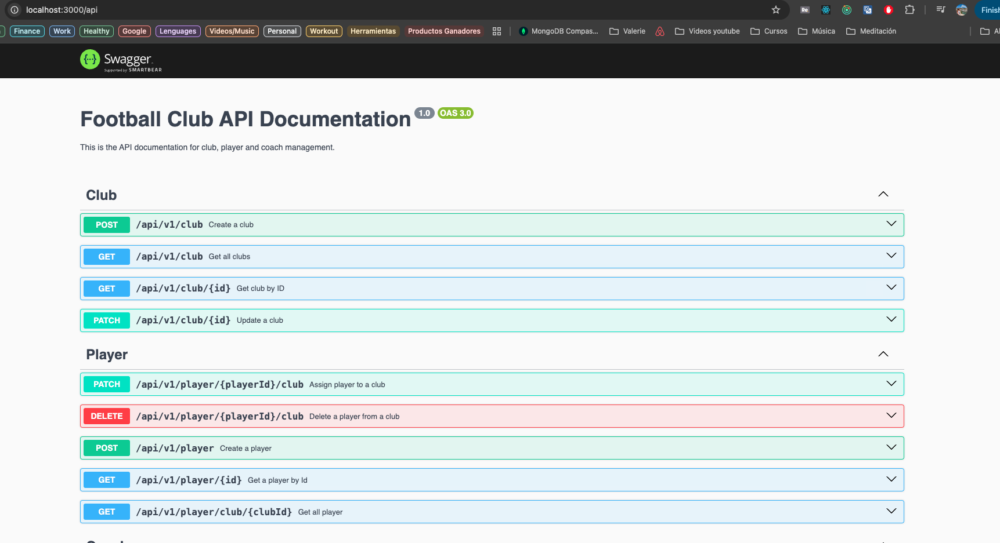

<p align="center">
  <a href="http://nestjs.com/" target="blank"></a>
</p>

# Football Club

## Descripción

Este es un proyecto backend para gestionar un **Football Club**, utilizando **NestJS** y **PostgreSQL** en un contenedor **Docker**. El sistema permite gestionar clubes, jugadores y entrenadores, realizando operaciones como alta, baja, modificación de presupuesto y validaciones.

## Pasos para configurar el proyecto

### 1. Clonar el proyecto

Clona este repositorio en tu máquina local:

```bash
git clone <url-del-repositorio>
````

### 2. Instalar dependencias

Instala las dependencias necesarias para ejecutar el proyecto:

```bash
npm install
````

### 3. Configurar el archivo de variables de entorno

Clona el archivo .env.template y renómbralo a .env:

```bash
cp .env.template .env
````

Luego, abre el archivo .env y ajusta las siguientes variables de entorno según tu configuración local:

```bash
DB_PASSWORD=your_password_here
DB_NAME=footballClubDb
# Otras variables necesarias para la configuración del proyecto
```

### 4. Levantar la base de datos con Docker

Asegúrate de tener Docker instalado en tu máquina. Luego, para levantar el contenedor de la base de datos Postgres, ejecuta:

```bash
docker-compose up -d
```

Este comando descargará la imagen de Postgres y levantará el contenedor en segundo plano.

### 5. Levantar el proyecto

Si es la primera vez que ejecutas el proyecto:

Deberás correr los seeds para poblar la base de datos con datos de ejemplo y luego levantar el proyecto con el siguiente comando:

```bash
RUN_SEEDS=true npm run start:dev
```

RUN_SEEDS=true indica que se ejecutarán los scripts de seeds para poblar la base de datos.

Si ya tienes la base de datos poblada:

Si ya has ejecutado el proyecto previamente y tienes los datos de la base de datos, solo ejecuta el siguiente comando para iniciar el servidor:

```bash
npm run start:dev
```

Este comando levantará el proyecto en modo de desarrollo.

### 6. Acceder a Swagger

Una vez que el proyecto esté levantado, puedes acceder a la documentación de la API a través de Swagger:

```bash
http://localhost:3000/api
```

Swagger proporcionará una interfaz gráfica donde podrás probar todas las rutas de la API, consultar las respuestas y ver los esquemas de los datos.




### Comandos útiles

- Levantar la base de datos: docker-compose up -d
- Levantar el servidor en modo desarrollo: npm run start:dev
- Ejecutar tests: npm test
- Verificar cobertura de tests: npm run test:cov

Autor

Val ♥️