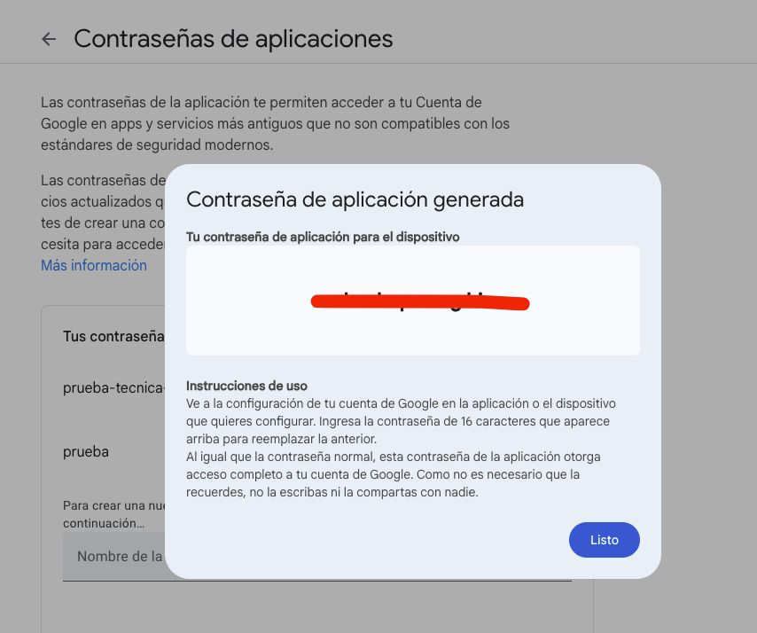

<p align="center">
  <a href="http://nestjs.com/" target="blank"></a>
</p>

# Football Club

## Descripción

Este es un proyecto backend para gestionar un **Football Club**, utilizando **NestJS** y **PostgreSQL** en un contenedor **Docker**. El sistema permite gestionar clubes, jugadores y entrenadores, realizando operaciones como alta, baja, modificación de presupuesto y validaciones.

## Pasos para configurar el proyecto

### 1. Clonar el proyecto

Clona este repositorio en tu máquina local:

```bash
git clone <url-del-repositorio>
````

### 2. Configurar el archivo de variables de entorno

Clona el archivo .env.template y renómbralo a .env con el siguiente comando:

```bash
cp .env.template .env
````

Luego, abre el archivo .env y ajusta las siguientes variables de entorno según tu configuración local:

```bash
DB_PASSWORD=your_password_here
DB_NAME=your_database_name_here

EMAIL_USER=your_email@gmail.com
EMAIL_PASS=generated_app_password --> en el punto 3 se especifica cómo generar este token

RUN_SEEDS=true --> Cambiar a false luego de levantar el proyecto por primera vez. Esta variable permita cargar los seeds la primera vez.
# Otras variables necesarias para la configuración del proyecto
```

### 3. Configuración para generar token de autenticación de Google:

- Debes tener el Factor de doble autenticación habilitado para Google el cual lo puedes hacer desde este link ---> [cuenta de google](https://myaccount.google.com/)

- Luego de tener el factor de doble autenticación habilitado, deberás crear una aplicación en el siguiente link --> [crear aplicación](https://myaccount.google.com/apppasswords?continue=https://myaccount.google.com/security?authuser%3D0%26rapt%3DAEjHL4PvBpQ9Az-k6Groakv-ugXUC1jinicbBrSbYtdIK6INO4_CM8RYoQwz4qWuV43_Xf8RGHD5Euvfmt4XtEtv1iw3aA-qhUPoIzsRcJ82nPoauUVtDKc%26origin%3D3&pli=1&rapt=AEjHL4NvL5VvROlm5iKW33FNf4BLR7jmJgJpeBlLnoQHGjuxfZIUyU_IP5OAbRun2LbfE-aw3KsqXBE0mz-xze209E1a0xKOqTIrf-iJ-Ph83C-hRylJ9xA) y al crearla, se mostrará en pantalla el token generado como se muestra en la imagen

- Copiar el token y agregarlo en el archivo .env:
```bash
EMAIL_USER=your_email@gmail.com --> email que usaste para generar el token
EMAIL_PASS=token_generated_here
```


### 4. Levantar el proyecto

- Si es la primera vez que ejecutas el proyecto:

Confirma que la variable RUN_SEEDS esté en true en el archivo de variables de entorno .env:

```bash
RUN_SEEDS=true
```

RUN_SEEDS=true indica que se ejecutarán los scripts de seeds para poblar la base de datos.

- Si ya tienes la base de datos poblada:

Si ya has ejecutado el proyecto previamente y tienes los datos de la base de datos, cambia la variable a false:

```bash
RUN_SEEDS=false
```

Ahora ejecuta el comando para levantar el proyecto con docker:

```bash
docker-compose up --build
```

Este comando levantará el proyecto en modo de desarrollo.

### 5. Acceder a Swagger

Una vez que el proyecto esté levantado, puedes acceder a la documentación de la API a través de Swagger:

```bash
http://localhost:3000/api
```

Swagger proporcionará una interfaz gráfica donde podrás probar todas las rutas de la API, consultar las respuestas y ver los esquemas de los datos.


### 6. Ejecutar pruebas unitarias

Instalar las dependencias del proyecto en local:

```bash
npm install
```

Ejecutar los test unitarios:

```bash
npm run test
```

Autor
Val ♥️